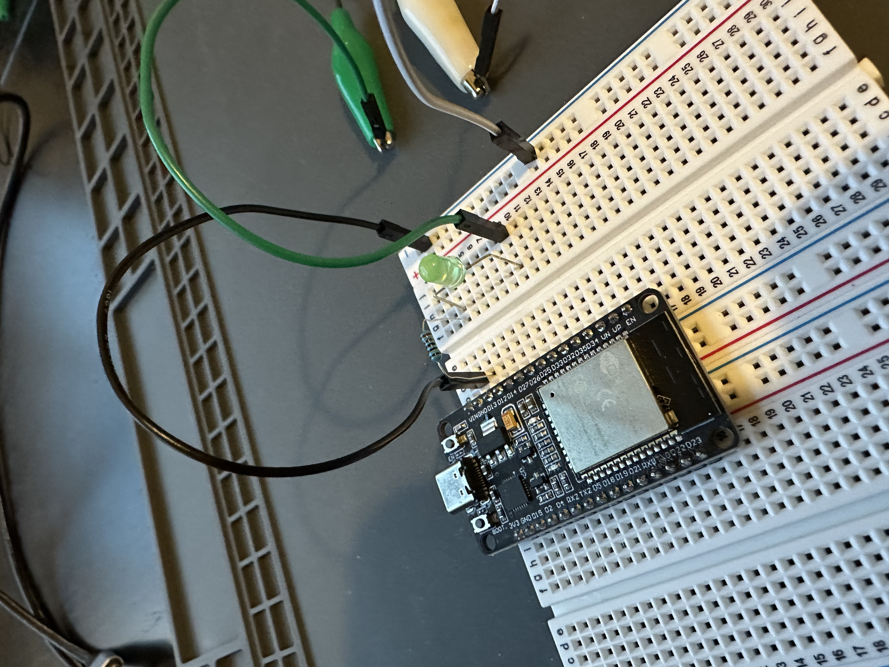
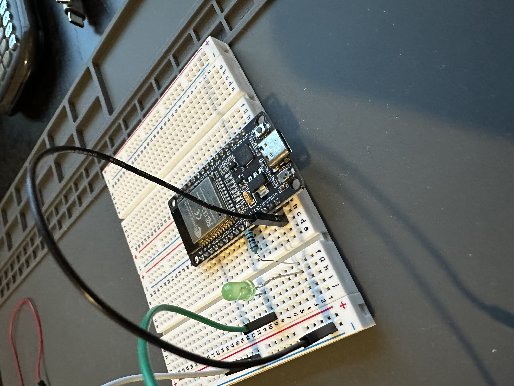
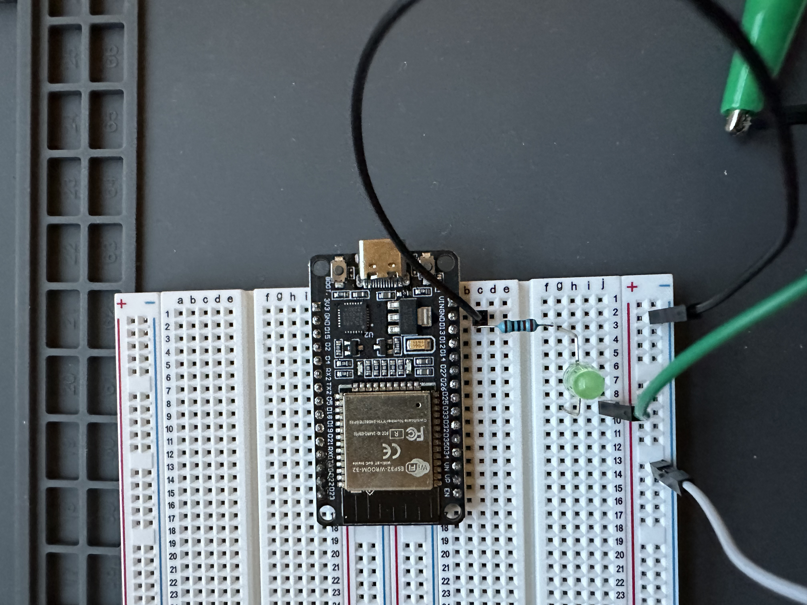
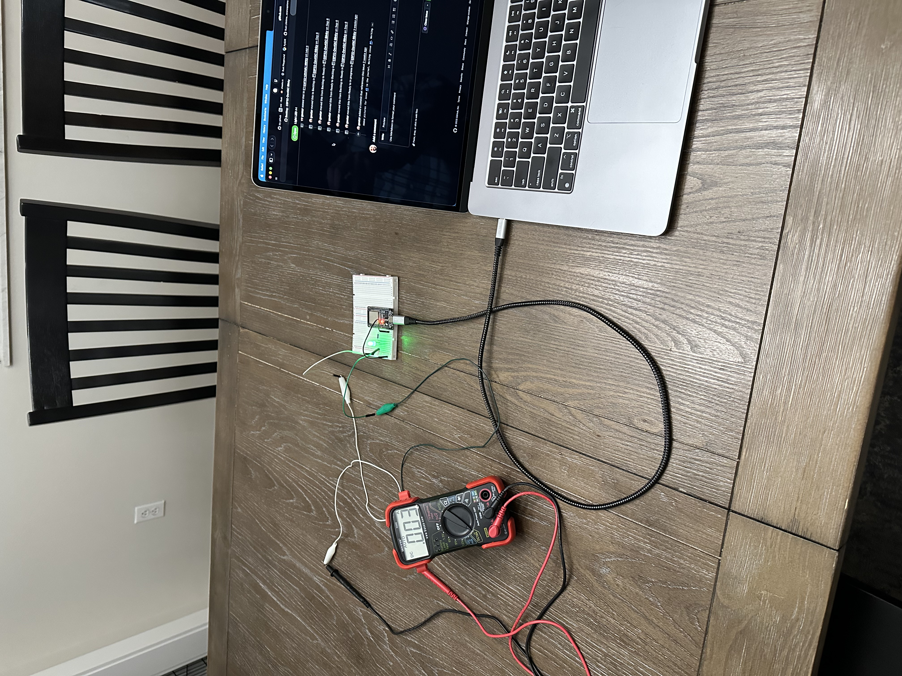
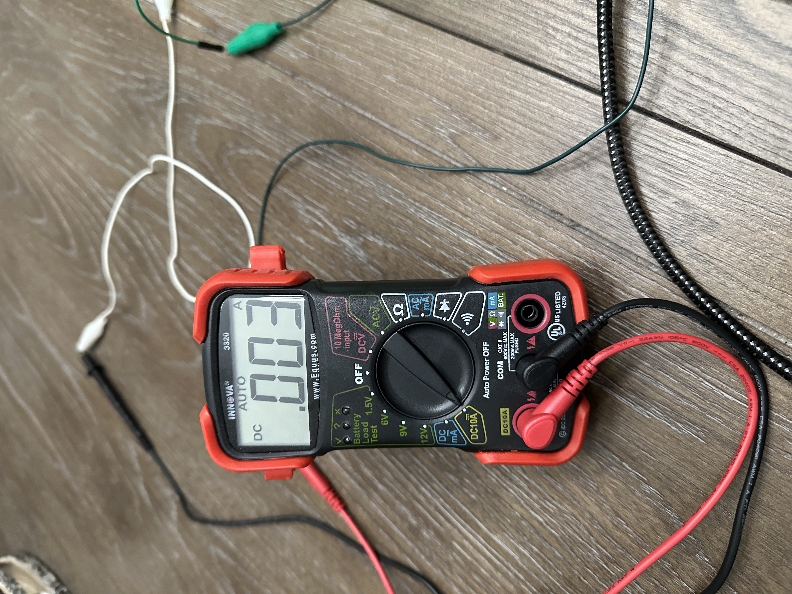
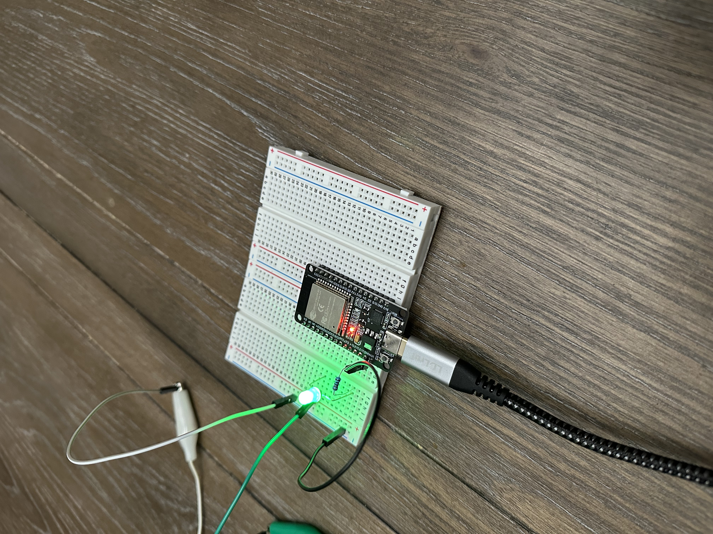
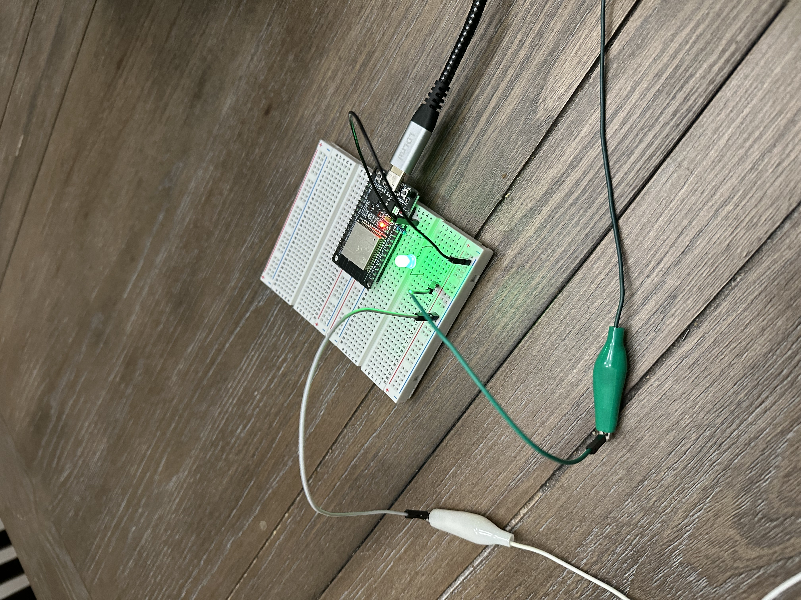

# ESP32-DevKitC Blinky Project Journal

### 6 Sep 2025
- Completed issue #2: Add Journal
- Working issue #3: Assemble components on breadboard
- Locating the power pin and determining the output voltage so I can determine the required resistance
    - 3V3 pin on DevKitC board is connected to 3V3 pin on the ESP32-WROOM-32 package
    - 3V3 pin on ESP32-WROOM-32 package is connected to VDD33 per peripheral schematic on pg. 34 of ESP32-WROOM-32 datasheet
    - Table 13 on pg. 26 of ESP32-WROOM-32 datasheet indicates that VDD33 is typically 3.3V
    - Recommended current through LED is 20 mA, so R = 3.3V / 0.02A = 165 ohm
- TODO:
    - Connect 3V3 pin on DevKitC to power rail on breadboard
    - Connect GND pin on DevKitC to GND rail on breadboard
    - Determine GPIO pin to connect LED to
    - Put LED and resistor in series on breadboard

### 7 Sep 2025
- Working issue #3: Assemble components on breadboard
- Reading the ESP32 documentation to determine which GPIO pin to connect the LED to
- Downloaded the ESP32 technical reference manual and added it to the repo
- In the Espressif online documentation I found the [Embedded Rust (no_std) on Espressif](https://docs.espressif.com/projects/rust/no_std-training/) HTML book
    - It has a blinky example
- Spending some time browsing through the TRM, trying to gain a broad understanding of the chip
- Table 3.3-6 on pg. 71 of the TRM indicates the GPIO registers are in the address range 0x3FF4_4000 - 0x3FF4_4FFF
- Reading Section 6.3 of TRM "Peripheral Output via GPIO Matrix"
- Section 6.3.3 "Simple GPIO Output" is exactly what I need:
    - To configure a pin as a simple GPIO output:
        - Set the GPIO_FUNCx_OUT_SEL field in the GPIO_FUNCx_OUT_SEL_CFG register to the special value 0x100
    - Then to drive the GPIO pin high/low, set bit x in the GPIO_OUT_DATA register
- The GPIO_FUNCx_OUT_SEL_CFG register is detailed on pg. 146 of the TRM
- Pins I see labeled on the ESP32-DevKitC board:
    - VIN, GND, 3V3, GND
    - D2, D4, D5, D12, D13, D14, D15, D18, D19, D21, D22, D23, D25, D26, D27, D32, D33, D34, D35
    - RX0, TX0, RX2, TX2
    - UN, UP, EN
- GPIO pins not labeled:
    - D0, D1, D3, D6, D7, D8, D9, D10, D11, D16, D17, D20, D24, D28, D29, D30, D31
- The specific model of the ESP32-DevKitC board I purchased, [AITRIP 3PCS Type c 30pins CP2102 ESP-WROOM-32 ESP32](https://www.amazon.com/AITRIP-ESP-WROOM-32-Development-Microcontroller-Integrated/dp/B0CR5Y2JVD/ref=sr_1_3?crid=322MUJASZNK8R&dib=eyJ2IjoiMSJ9.UdLxS8engRob9RiEzo8Gffis-O1Rs2BEJTjG2jb7tqqGwDCNIqTsveMEEHCUzU-ywqA0KULpdX9ha2s_v4hyc9jPUU9SaFCFVWf2qNRVwndljeITy13b8XYyXYEbRW_sCUxwtXASY23KGGbbQzXepj9z_fmBFecjNhrX9DjVTgsaxIvPQCt_Pav9OheR0A_S-gH-1Lyw2-rzxfPhvEsc4Lclwdymcy6c0EIvNsEH7JQ.JGVXYN8KKSjLOVCcAUKIW4EdlNryX9tvxNFAw7vNYaQ&dib_tag=se&keywords=esp32%2Busb-c&qid=1757279090&sprefix=esp32%2Busb-c%2Caps%2C175&sr=8-3&th=1), only exposes 30 of the ESP32-WROOM-32 package's 38 pins. The ESP32-DevKitC board sold by Espressif exposes all 38 pins.
- Table 6.10-1 IO_MUX Pin Summary on pg. 132 of the TRM shows the function of each of the 34 I/O pins on the ESP32 processor
- The pin labels on the ESP32-DevKitC board seem to be arbitrary. My suspicion was that the default function (function 0 in Table 6.10-1) of each pin was the label shown, but this is not the case.
- Shared I/O pin functions:
    - GPIO1 (U0TXD), GPIO3 (U0RXD)
    - GPIO6 - GPIO11 (SD / SPI)
    - GPIO16 (U2RXD), GPIO17 (U2TXD)
    - Pin 20 is not an I/O pin
    - Pin 24 is not an I/O pin
    - Pins 28 - 31 are not I/O pins
- Given the shared I/O pin functions and the pins that are not I/O pins, the pins not exposed on the ESP32-DevKitC board are:
    - GPIO0
    - GPIO36 - GPIO39

### 9 Sep 2025
- Working issue #3: Assemble components on breadboard
- Working on a pin mappings table

#### I/O Pin Mapping

**NOTE:** GPIO20, GPIO24, and GPIO28 - GPIO31 don't exist.

|     | ESP32-DevKitC | ESP32-WROOM-32 | ESP32 GPIO | ESP32 Pin Name | ESP32 Function 0 |                                                                   Notes                                                                   |
| :-: | :-----------: | :------------: | :--------: | :------------: | :--------------: | :---------------------------------------------------------------------------------------------------------------------------------------: |
|  1  |      NC       |      IO0       |     0      |     GPIO0      |      GPIO0       |                                    Strapping GPIO (boot mode) Capacitive-sensing Analog-enabled                                     |
|  2  |      TX0      |      TXD0      |     1      |     U0TXD      |      U0TXD       |                                                            Used to flash chip                                                             |
|  3  |      D2       |      IO2       |     2      |     GPIO2      |      GPIO2       |                                    Strapping GPIO (boot mode) Capacitive-sensing Analog-enabled                                     |
|  4  |      RX0      |      RXD0      |     3      |     U0RXD      |      U0RXD       |                                                            Used to flash chip                                                             |
|  5  |      D4       |      IO4       |     4      |     GPIO4      |      GPIO4       |                                                   Capacitive-sensing Analog-enabled                                                    |
|  6  |      D5       |      IO5       |     5      |     GPIO5      |      GPIO5       |                                                    Strapping GPIO (SDIO slave timing)                                                     |
|  7  |      NC       |      CLK       |     6      |     SD_CLK     |      SD_CLK      |                                           Connected to SPI flash integrated on WROOM-32 module                                            |
|  8  |      NC       |      SD0       |     7      |   SD_DATA_0    |    SD_DATA_0     |                                           Connected to SPI flash integrated on WROOM-32 module                                            |
|  9  |      NC       |      SD1       |     8      |   SD_DATA_1    |    SD_DATA_1     |                                           Connected to SPI flash integrated on WROOM-32 module                                            |
| 10  |      NC       |      SD2       |     9      |   SD_DATA_2    |    SD_DATA_2     |                                           Connected to SPI flash integrated on WROOM-32 module                                            |
| 11  |      NC       |      SD3       |     10     |   SD_DATA_3    |    SD_DATA_3     |                                           Connected to SPI flash integrated on WROOM-32 module                                            |
| 12  |      NC       |      CMD       |     11     |     SD_CMD     |      SD_CMD      |                                           Connected to SPI flash integrated on WROOM-32 module                                            |
| 13  |      D12      |      IO12      |     12     |      MTDI      |       MTDI       |        Strapping GPIO (internal LDO voltage) JTAG Capacitive-sensing Analog-enabled **NOTE:** No built-in JTAG module         |
| 14  |      D13      |      IO13      |     13     |      MTCK      |       MTCK       |  JTAG Capacitive-sensing Analog-enabled **NOTE:** No built-in JTAG module **OK to use** if not used by external JTAG module   |
| 15  |      D14      |      IO14      |     14     |      MTMS      |       MTMS       |  JTAG Capacitive-sensing Analog-enabled **NOTE:** No built-in JTAG module **OK to use** if not used by external JTAG module   |
| 16  |      D15      |      IO15      |     15     |      MTD0      |       MTD0       | Strapping GPIO (U0TXD print ctrl, SDIO slave timing) JTAG Capacitive-sensing Analog-enabled **NOTE:** No built-in JTAG module |
| 17  |      RX2      |      IO16      |     16     |     GPIO16     |      GPIO16      |                                       No in-package flash/PSRAM, no WROOM-32 PSRAM **OK to use**                                       |
| 18  |      TX2      |      IO17      |     17     |     GPIO17     |      GPIO17      |                                          No in-package flash, no WROOM-32 PSRAM **OK to use**                                          |
| 19  |      D18      |      IO18      |     18     |     GPIO18     |      GPIO18      |                                                                                                                                           |
| 20  |      D19      |      IO19      |     19     |     GPIO19     |      GPIO19      |                                                                                                                                           |
| 21  |      D21      |      IO21      |     21     |     GPIO21     |      GPIO21      |                                                                                                                                           |
| 22  |      D22      |      IO22      |     22     |     GPIO22     |      GPIO22      |                                                                                                                                           |
| 23  |      D23      |      IO23      |     23     |     GPIO23     |      GPIO23      |                                                                                                                                           |
| 24  |      D25      |      IO25      |     25     |     GPIO25     |      GPIO25      |                                                        Analog-enabled (ADC or DAC)                                                        |
| 25  |      D26      |      IO26      |     26     |     GPIO26     |      GPIO26      |                                                        Analog-enabled (ADC or DAC)                                                        |
| 26  |      D27      |      IO27      |     27     |     GPIO27     |      GPIO27      |                                                   Capacitive-sensing Analog-enabled                                                    |
| 27  |      D32      |      IO32      |     32     |     32K_XP     |      GPIO32      |                                                   Capacitive-sensing Analog-enabled                                                    |
| 28  |      D33      |      IO33      |     33     |     32K_XN     |      GPIO33      |                                                   Capacitive-sensing Analog-enabled                                                    |
| 29  |      D34      |      IO34      |     34     |     VDET_1     |      GPIO34      |                                                       Input only Analog-enabled                                                        |
| 30  |      D35      |      IO35      |     35     |     VDET_2     |      GPIO35      |                                                       Input only Analog-enabled                                                        |
| 31  |      VP       |   SENSOR_VP    |     36     |   SENSOR_VP    |      GPIO36      |                                                       Input only Analog-enabled                                                        |
| 32  |      NC       |       NC       |     37     |  SENSOR_CAPP   |      GPIO37      |                                                       Input only Analog-enabled                                                        |
| 33  |      NC       |       NC       |     38     |  SENSOR_CAPN   |      GPIO38      |                                                       Input only Analog-enabled                                                        |
| 34  |      VN       |   SENSOR_VN    |     39     |   SENSOR_VN    |      GPIO39      |                                                       Input only Analog-enabled                                                        |

### 10 Sep 2025
- Working issue #3: Assemble components on breadboard
- Filling out the I/O pin mappings table

### 12 Sep 2025
- Working issue #3: Assemble components on breadboard
- Determining which GPIO pin to connect LED to
- Explain pull up / pull down resistors
    - Pull up / pull down resistors only apply to input pins
    - If nothing is connected to an input pin, the pin is essentially floating, termed high impedance (Hi-Z)
    - A floating pin can randomly read as HIGH or LOW depending on noise, leakage,
        or even your finger touching the board
    - Pull up / pull down resistors give the input pin a well-defined default state
    - Pull up resistor
        - Connects pin -> resistor -> Vcc
        - Input pin reads HIGH when nothing is connected to it
        - Example: Push button connected to GND on one side and the input pin on the other side.
            - When button is released (default state), pin is pulled up (HIGH)
            - When button is pushed, pin is shorted to ground (LOW)
    - Pull down resistor
        - Connects pin -> resistor -> GND
        - Input pin reads LOW when nothing is connected to it
        - Example: Push button connected to Vcc on one side and the input pin on the other side.
            - When the button is released (default state), pin is pulled down (LOW)
            - When the button is pressed, pin is driven to Vcc (HIGH)
    - "Weak" internal pull up / pull down resistors
        - Have high resistance (10s of kiloohms)
        - Only source/sink a very small amount of current when the pin is forced to the opposite level
        - Called "weak" because they don't fight a change to the pin state. The very small current flow means:
            - The voltage drop across an external button pulling the pin to the opposite level is neglible
                - The extremely low resistance of the button itself combined with the very low current results in
                    almost no voltage drop across the button
            - This means it's very easy for an external button to drive the pin:
                - Very close to 0V when driving it low
                - Very close to Vcc when driving it high
- Explain push / pull output, open-drain output
    - Push / pull
        - An output pin has 2 transistors:
            - One connects it to Vcc (high-side)
            - One connects it to GND (low-side)
        - Depending on the logic level:
            - HIGH:
                - High-side transistor turns on, actively driving the pin to Vcc (HIGH)
                - MCU sources current (pushes it out)
            - LOW:
                - Low-side transistor turns on, actively driving the pin to GND (LOW)
                - MCU sinks current (pulls it in)
    - Open-drain
        - An output pin has only the low-side transistor
        - Depending on the logic level:
            - LOW:
                - Transistor turns on, actively driving the pin to GND (LOW)
                - MCU sinks current (pulls it in)
            - HIGH:
                - Transistor turns off, pin is high impedance (Hi-Z)
                - No current flow
        - To drive the pin to Vcc (HIGH), you need a pull-up resistor (internal or external) that
            pulls the line up to Vcc when the pin is not driven low
        - Great for shared lines
            - Say you have 2 MCUs connected to the same line using push / pull outputs:
                - MCU A drives the line HIGH
                - MCU B drives the line LOW
                - This results in a short circuit from Vcc to GND, which is disasterous
            - Open drain fixes this
                - Each MCU can only pull the line LOW
                - To represent HIGH, both MCUs must stop pulling the line LOW, then
                    the pull-up resistor pulls the line up to Vcc
### 13 Sep 2025
- Working issue #3: Assemble components on breadboard
- Looking more closely through the TRM to understand more about the chip
- ESP32-DOWD is a dual-core chip
    - PRO_CPU (protocol CPU) starts running immediately after SoC reset
    - APP_CPU (application CPU) held in reset after SoC reset
    - During startup, PRO_CPU does all the initialization
    - The [Startup API Guide](https://docs.espressif.com/projects/esp-idf/en/latest/esp32/api-guides/startup.html) has more dtails
- Back to determining which GPIO pin to connect the LED to
    - Pg. 114 of the TRM states that:
        - GPIO pins 34-39 are input-only, so those pins can't be used
        - 5 GPIO pings are strapping GPIO:
            - Listed in table 3-1 on pg. 22 of the datasheet
            - GPIO0, GPIO2, GPIO5, MTDI (GPIO12), MTDO (GPIO15)
            - On power-up or reset, the ESP32’s internal reset logic reads the levels (HIGH/LOW) of strapping GPIOs.
                    These values are latched into internal registers and used to decide:
                - Boot mode
                - Flash voltage
                - Other startup options
            - After reset strapping pins return to normal GPIO function
            - If you connect a peripheral to a strapping pin and it pulls the line high/low at reset, you might
                prevent the ESP32 from booting correctly
            - Imagine old motherboards with DIP switches or jumpers you set before power-on.
                Strapping GPIOs are the ESP32’s built-in version of that — only you don’t flip switches,
                you wire signals.
            - GPIO0 / GPIO2 control the boot mode:
                - GPIO0 = 1, GPIO2 = any -> SPI boot mode (boot from flash)
                - GPIO0 = 0, GPIO2 = 0 -> flash firmware
            - GPIO0 isn't exposed on the ESP32-DevKitC anyway, so it can't be used
            - Decision: Don't use any of the strapping GPIO as they may disrupt booting/flashing the chip
    - Pg. 17 of the ESP32 datasheet states that the following GPIO are allocated for communication with
            in-package flash/PSRAM and NOT recommended for other uses:
        - GPIO6 - GPIO11, GPIO16, GPIO17
        - This explains why GPIO6 - GPIO11 are not exposed by the ESP32-DevKitC
        - Decision: Don't use GPIO16 or GPIO17
    - Pg. 17 of the ESP32 datasheet states that the following pins are used for important functions:
        - GPIO12 - GPIO15 are used for JTAG. However, the ESP32-DevKitC board doesn't have an on-board
            JTAG adapter, so debugging via JTAG isn't possible out of the box.
        - GPIO1 and GPIO3 are used to flash the chip.
        - Decision: GPIO12 - GPIO15 are OK to use. Don't use GPIO1 or GPIO3 as it could disrupt flashing.
    - Many of the pins in table 6.10-1 on pg. 132 of the TRM have IE=1 according to the Reset column
- I believe the reason that the ESP32-DevKitC board doesn't expose GPIO0 is because GPIO0 is a strapping GPIO
        that controls whether the ESP32 chip boots from flash or flashes firmware.
    - LOW -> UART download mode (used for flashing firmware)
    - HIGH -> Normal boot from SPI flash
- I didn't calculate the resistor value correctly above.
    - A green LED has a forward bias voltage Vf of ~2.2 V, meaning it will start conducting when
        its positive terminal reaches 2.2 V
    - The MCU provides 3.3 V, so the voltage drop across the resistor is 1.1 V
    - If we want 5 mA current out the GPIO pin and through the LED, we need a 1.1 / 0.005 = 220 ohm resistor
### 14 Sep 2025
- Working issue #3: Assemble components on breadboard
- My diode test feature on my multimeter is unable to measure the forward voltage of an LED as it
    doesn't provide enough voltage
- Constructed a test circuit that lights up the LED then used my multimeter to measure the voltage across it,
    which was 2.55 V
- Now, given the MCU supply voltage of 3.3 V, the voltage drop across the resistor is 3.3 - 2.55 = 0.75 V
- I want drive 5 mA through the LED, so the resistor needs to be 0.75 / 0.005 = 150 ohms
- OK after looking into this further I am pretty sure that 2.55 V is not the forward bias of the LED
- Tried measuring the current through the LED but my multimeter caps out at 10 mA in the 200 mA fuse port
- Switched to the 10 A fuse port and LED lights up, current says 70 mA
- Measuring voltage across resistor outside circuit with Fluke meter lights up the LED and reads 0.95 V.
    Not sure what this is, it's too low to light the LED, but the LED was lit up.
### 21Sep 2025
- My multimeter must be used with the 10 A fuse port to read current
	- The 200 mA port doesn't seem to to work
	- The fluke multimeter can't measure sub 1 A currents
- Completed test circuit
- Tried red, green, and blue LEDs. Verified the following forward voltages:
	- Red: 1.8 V
	- Green: 2.2 V
	- Blue 3 V
- I didn't try yellow, but it's between red and green so I'll assume 2.0 V
### 22 Sep 2025

#### LED Forward Voltages

| Color      | Forward Voltage (V) |
| ---------- | ------------------- |
| Red        | 1.8                 |
| Yellow     | 2.0                 |
| Green      | 2.2                 |
| Blue/White | 3.0                 |
- Re-reading the datasheet and TRM sections on GPIO
- PSRAM - Pseudo-Static RAM
	- Offers the high density of DRAM with the ease-of-use of SRAM
	- Internally PSRAM is DRAM. It uses dynamic memory cells that require periodic refreshing.
	- Externally PSRAM is SRAM-like. It includes a built-in refresh controller, so to the microcontroller, it behaves like SRAM -- no refresh management needed.
- ESP32-D0WDQ6
	- D: Dual core
	- 0: No in-package flash
	- WD: Wi-Fi b/g/n + Bluetooth/Bluetooth LE dual mode
	- Q6: QFN 6\*6 (6 mm x 6 mm)
	- No in-package PSRAM
	- Not rated for high temperature
	- Based on chip revision v1 or v1.1
- Pins SCK/CLK, SDO/SD0, SDI/SD1, SHD/SD2, SWP/SD3 and SCS/CMD, namely, GPIO6 to GPIO11 on the ESP32-D0WDQ6 chip, are connected to the SPI flash integrated on the ESP32-WROOM-32 module and are not recommended for other uses (pg. 10 of ESP32-WROOM-32 datasheet)
- **NOTE:** Ensure the pin chosen to connect the LED to has a default function (function 0) that's not GPIO. This ensures we must change its function to be GPIO.
- Configure the ESP32 chip to be in modem-sleep mode (Wifi/Bluetooth radio disabled)
- **TODO:** Update the GPIO pin table with a comment indicating which pins are analog-enabled (18) / capacitive-touch-enabled (10)
- When choosing a GPIO pin to connect the LED to, be sure to look at the "Drive Strength" column in the IO_MUX table. This value is configurable.
	- Default is 20 mA
	- 10 mA should work as I only plan on driving 5 mA out the pin. So configure the GPIO pin for 10 mA drive strength.
- When choosing a GPIO pin to connect the LED to, be sure to look at the "After Reset" column in the IO_MUX table
	- OE (output enable) = 0 for all GPIO pins after reset
- GPIO pins to connect LED to:
	- Start with all output pins that aren't used for some special purpose:
		- 4, 13, 14, 16, 17, 18, 19, 21 - 23, 25 - 27, 32, 33
	- Narrow this down to a pin whose default function is not GPIO:
		- 13, 14
	- Choosing GPIO13!
### 23 Sep 2025
- The circuit is now fully assembled. I did settle on a forward voltage of 2.2 V for  The green/gray wires attached to the green/white clips go to my multimeter so I can measure the current through the circuit when the LED is on.
	- 
	- 
	- 

### 16 Oct 2025
* Wrote the program to light the LED. It works! I had several issues along the way though.
* Issue #1: Containerization
	* Instead of installing the custom xtensa rust toolchain and the associated esp-rs tools on my macbook, espressif provides a container image that can be built for each ESP chip with all the required tools installed. I used the espressif/idf-rust:esp32_latest image.
	* Initially my troubles stemmed from me never having worked with containers before. Each time I built the project it used a fresh container, forcing it to re-download the dependencies. To avoid this unnecessary slowdown, I figured out how to mount a Docker volume to the /home/esp/.cargo folder to cache the downloaded dependencies. Now after the first build the dependencies were not re-downloaded; the cached versions were used. The dependencies still have to be recompiled with each change to my program. This is true with or without a container. My program code along with the code for each dependency is compiled together into a single binary. It's just not possible to build the dependencies once then re-use those binaries when using rust.
	* I was using Zed as my editor at first. I noticed that my intellisense wasn't working though. This was because rust analyzer (RA) was running on my host, which didn't have the xtensa rust toolchain installed, preventing RA from being able to build the code. This prompted me to switch to using VS code along with its dev containers extension. This installs a VS code server along with any desired extensions (including RA) inside the container. Because RA was now installed inside the container where the xtensa rust toolchain was installed, intellisense started working.
		* **NOTE:** As discussed below I stopped using the container and installed the xtensa rust toolchain and associated tools on my host, so I could go back to using Zed if I wanted. But I think I'm going to stick with VS code for now. It works well for me.
	* The final issue I had with the container, which forced me to stop using the container altogether, was that the container couldn't access the virtual serial port created when I plugged my board into my macbook. This meant I couldn't flash my program onto the chip, which is obviously not going to work. macOS can't run containers directly. It uses a small Linux VM to run the containers. macOS security policy doesn't allow this Linux VM to access physical devices plugged into the macbook. There's nothing I could do. I had to drop the container and install the xtensa rust toolchain and associated tools directly on my macbook.
* Issue #2: Rust Analyzer
	* Rust analyzer (RA) worked fine except for one small part that really bugged me. I noticed that RA was showing the return type of the esp_hal::init function as {unknown}. I looked at this **way** longer than I should have. RA was working fine for the rest of the program. I spent 2 or 3 days researching this and trying various VS code settings for the RA extension. Nothing fixed it. The esp_hal::init function returns a Peripheral structure. The definition of this structure in the esp_hal crate source code is passed to a procedural macro. Oddly enough, the program built fine. So cargo obviously recognized the Peripheral structure without issue. I learned that RA doesn't use cargo's macro facilities; it implements this on its own. My only explanation is that RA's macro facilities are unable to handle the macros involved in defining the Peripheral structure.
	
	
	
	
### 17 Oct 2025
- Fixed issue #5. The LED is now on for 1 second then off for 1 second (0.5 Hz). This was simple to write because the esp_hal crate provides the time::Instant structure and the time::Duration structure.
- Fixed issue #6. The fix for issue #5 is also being used for issue #6. See the comments on issue #5.
- Working on issue #7
- Pulled down the no_std-training git repo from the [embedded Rust (no std) training](https://docs.espressif.com/projects/rust/no_std-training/) with the following command:
	- git clone "https://github.com/esp-rs/no_std-training.git"
- Looked at the button-interrupt example project at intro/button-interrupt
- Learned that I need to annotate an interrupt handler with the esp_hal::handler attribute
- I know I want to use one of the general purpose timer peripherals to generate an interrupt every 1 second
- Read through the timer peripheral section in the datasheet
- Started reading the Interrupt Matrix chapter in the TRM
- Started reading the Timer Group (TIMG) chapter in the TRM
	- 16-bit Prescalar
		- Each timer uses the APB clock (APB_CLK, normally 80 MHz) as the basic clock
		- This clock is then divided down by a 16-bit prescalar which generates the time-based counter clock (TB_clk)
		- Every cycle of TB_clk causes the time-based counter to increment / decrement by one
		- The timer must be disabled before before changing the prescalar
			- Clear TIMGn_Tx_EN to disable timer x in group n
			- Set TIMGn_Tx_DIVIDER to configure the prescalar for timer x in group n
				- Prescalar must be in the range \[2, 65536\]
				- When TIMGn_Tx_DIVIDER is:
					- 1 or 2, the clock divisor is 2
					- 0, the clock divisor is 65536
					- any of value d, the clock divisor is d
	- 64-bit Time-base Counter
		- The time-base can be configured to count either up or down
			- Set TIMGn_Tx_DIVIDER: count up
			- Clear TIMGn_Tx_DIVIDER: count down
		- Counting can be enabled or disabled
			- Clear TIMGn_Tx_EN: stop counting. This freezes the counter, retaining its value
			- Set TIMGn_Tx_EN: resume counting
		- Set new counter value by setting registers TIMGn_Tx_LOAD_LO and TIMGn_Tx_LOAD_HI to the desired value
			- Hardware will ignore these register settings until a reload. A reload causes the contents of these registers to be copied to the counter itself.
			- A reload can be triggered by:
				- An alarm (auto-reload at alarm)
					- Set TIMGn_Tx_AUTORELOAD register to enable auto-reload at alarm
				- Software (software instant reload)
					- Write any value to TIMGn_Tx_LOAD_REG register to trigger a software instant reload
					- This will cause the counter value to be changed instantly
		- Software can change the direction of the time-base counter by changing the value of TIMGn_Tx_INCREASE
		- Writing any value to TIMGn_TxUPDATE_REG latches the time-base counter value into the TIMGn_TxLO_REG and TIMGn_TxHI_REG registers to be read by software at any point in time
	- Alarm Generation
		- A triggered alarm can cause a reload and/or an interrupt to occur
		- Alarm is triggered when the alarm registers TIMGn_Tx_ALARMLO_REG and TIMGn_Tx_ALARMHI_REG match the current timer value
		- Alarm also triggers when:
			- Current timer value is higher than the current alarm value (up-counting timer)
			- Current timer value is lower than the current alarm value (down-counting timer)
		- The timer alarm enable bit is automatically cleared once an alarm occurs
	- Interrupts
		- TIMGn_INT_T0_INT: An alarm event on timer 0 generates this interrupt
### 18 Oct 2025
- Learning how to use the esp_hal crate to configure and start a timer
	- The General-purpose Timer example in the esp_hal documentation for the esp_hal::timer::timg module clearly shows a call to timer0.start. However, the esp_hal::timer::timg::Timer structure doesn't directly define a start method. I found in the esp_hal source code that the start method is defined in the esp_hal::timer::Timer trait. However, the docs for this trait don't show the start method. Looking at the esp_hal source I see that the start method (and many other methods) are marked with the doc(hidden) attribute. Why would they hide the start method?
		- Turns out that the esp_hal::timer::Timer trait is a low level trait. Its use by developer is discouraged. Instead developers are encouraged to use higher level abstractions like esp_hal::timer::OneShotTimer and esp_hal::timer::PeriodicTimer. These structures provide their own start method directly.
	- The esp_hal crate has abstracted away all the low-level details, providing the PeriodicTimer structure
		- Call enable_interrupt(true)
		- Call set_interrupt_handler